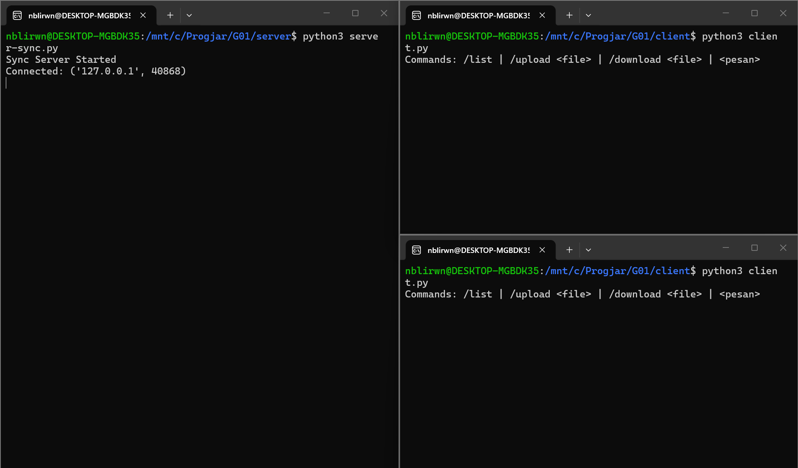
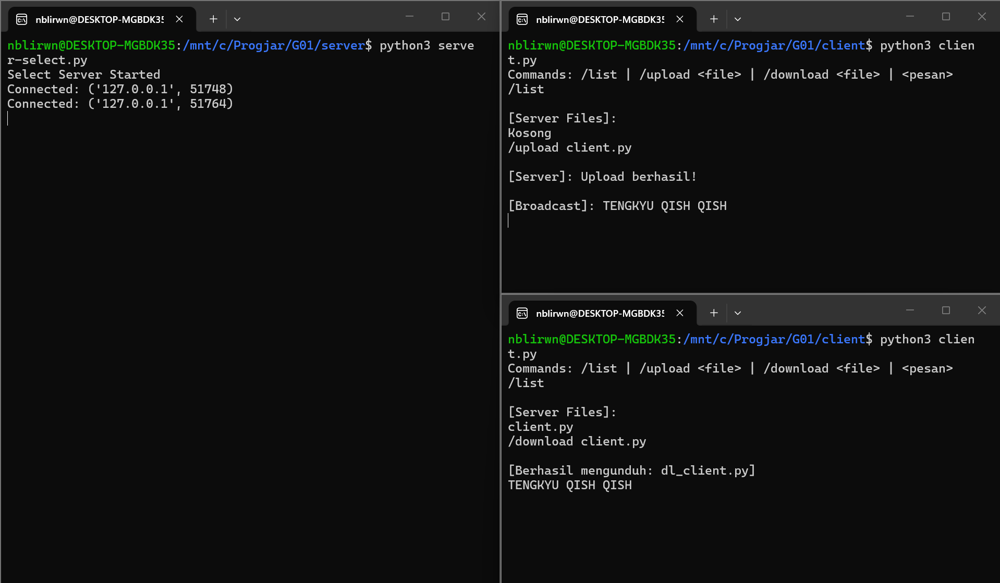
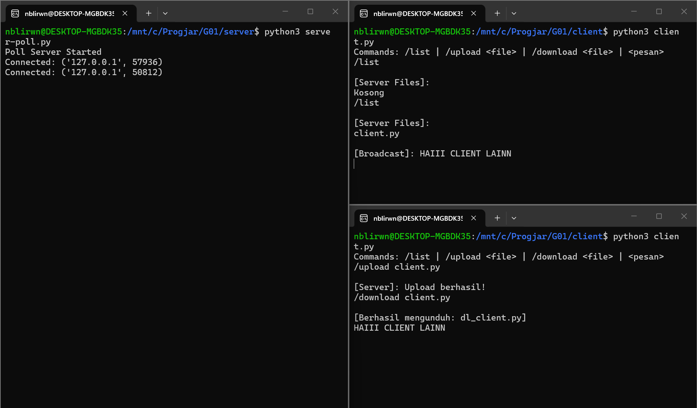
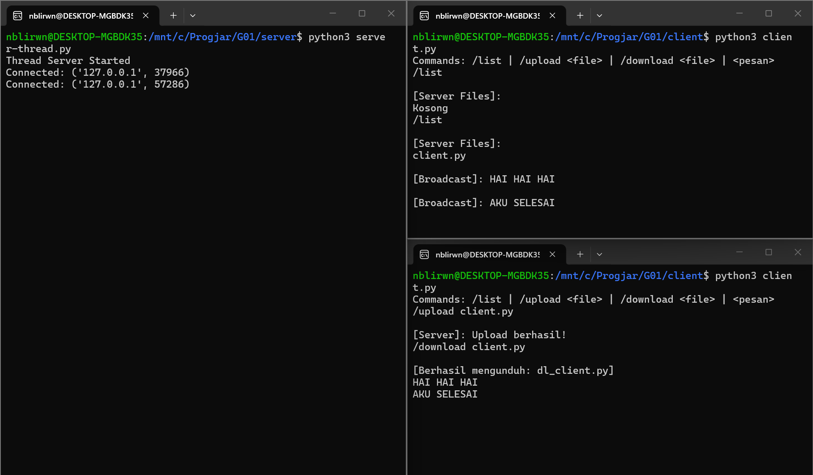

[](https://classroom.github.com/a/mRmkZGKe)
# Network Programming - Assignment G01

## Anggota Kelompok
| Nama           | NRP        | Kelas     |
| ---            | ---        | ----------|
| Nabil Irawan | 5025241231 | C |
| Aminudin Wijaya | 5025241242 | C |

## Link Youtube (Unlisted)
Link ditaruh di bawah ini
```
https://youtu.be/ZDM5xyT1PK0?si=EiUVatQQlle0M8qf
```

## Penjelasan Program

# Penjelasan Kode: Client-Server TCP

Secara keseluruhan code ini adalah implementasi aplikasi Client-Server sederhana menggunakan protokol TCP melalui modul `socket` di Python dengan mendukung fitur broadcast dan transfer file.

---

## 1. `client.py`

```python
import socket, threading, os, struct, sys
```
* `socket` membuat jalur komunikasi jaringan
* `threading` running proses listen msg dari server di background tanpa menghentikan proses mengetik pesan
* `os` digunakan untuk berinteraksi dengan sistem operasi, seperti membaca file dan mematikan program
* `struct` mengonversi tipe data Python menjadi format raw byte
* `sys` digunakan untuk interaksi spesifik dengan sistem

### `send_msg`
```python
def send_msg(sock, data):
    header = struct.pack(">I", len(data))
    sock.sendall(header + data)
```
* `header = struct.pack(">I", len(data))` menghitung len data yang akan dikirim, lalu wrapping menjadi *integer unsigned* 4-byte
* `sock.sendall()` mengirimkan 4-byte header tersebut diikuti oleh data aslinya ke soket

### `recv_msg`
```python
def recv_msg(sock):
    try:
        header = sock.recv(4)
        if len(header) < 4: return None
        length = struct.unpack(">I", header)[0]
        buf = b""
        while len(buf) < length:
            chunk = sock.recv(length - len(buf))
            if not chunk: return None
            buf += chunk
        return buf
    except:
        return None
```
* `header = sock.recv(4)` read 4 byte pertama dari koneksi
* `if len(header) < 4: return None` jika gagal mendapat 4 byte maka koneksi terputus
* `length = ...` melakukan unpack 4-byte tadi kembali menjadi angka untuk mengetahui ukuran sisa msg
* `while len(buf) < length:` terus-menerus mengumpulkan data / chunk sampai total byte sama persis dengan angka `length`
* `except` menangkap error dan mengembalikan `None`

### `receive_handler`
```python
def receive_handler(sock):
    while True:
        data = recv_msg(sock)
        if not data:
            print("\nTerputus dari server.")
            os._exit(0)
```
* Running terus-menerus di thread terpisah untuk memantau msg masuk. Jika `data` kosong, klien menyimpulkan server mati dan `os._exit(0)`

```python
        if data.startswith(b"FILE|"):
            _, filename, content = data.split(b"|", 2)
            fname = "dl_" + filename.decode()
            with open(fname, "wb") as f:
                f.write(content)
            print(f"\n[Berhasil mengunduh: {fname}]")
        else:
            print(f"\n{data.decode()}")
```
* Jika data diawali `FILE|` berarti respons download
* Menambahkan prefix `dl_` pada file yang diunduh agar tidak menimpa file lokal asli, lalu menyimpannya ke storage
* Jika bukan file, pesan di-decode dari byte ke teks dan diprint ke layar

### `__main__`
```python
if __name__ == '__main__':
    s = socket.socket(socket.AF_INET, socket.SOCK_STREAM)
    s.connect(('127.0.0.1', 5000))
    
    threading.Thread(target=receive_handler, args=(s,), daemon=True).start()
    print("Commands: /list | /upload <file> | /download <file> | <pesan>")
```
* Membuat soket IPv4 dan TCP, lalu terhubung ke localhost di port 5000
* Memulai `receive_handler` di background

```python
    while True:
        cmd = input()
        if cmd.startswith("/upload "):
            filename = cmd.split(" ", 1)[1]
            if os.path.exists(filename):
                with open(filename, "rb") as f:
                    content = f.read()
                send_msg(s, b"UPLOAD|" + filename.encode() + b"|" + content)
            else:
                print("File tidak ditemukan.")
        elif cmd.startswith("/download "):
            filename = cmd.split(" ", 1)[1]
            send_msg(s, b"DOWNLOAD|" + filename.encode())
        elif cmd == "/list":
            send_msg(s, b"LIST")
        else:
            send_msg(s, b"MSG|" + cmd.encode())
```
* Loop untuk membaca perintah pengguna, kemudian memeriksa awalan input (`/upload`, `/download`, `/list`) dan menjalankan aksi sesuai perintah tersebut, atau mengirimnya sebagai pesan teks (`MSG|`) jika bukan perintah

---

## 2. `server-sync.py`

### `process_client_data`
```python
def process_client_data(sock, data, clients_list):
    if data.startswith(b"UPLOAD|"):
        _, filename, content = data.split(b"|", 2)
        with open("srv_" + filename.decode(), "wb") as f:
            f.write(content)
        send_msg(sock, b"[Server]: Upload berhasil!")
```
* Menangani kiriman file, isi file disimpan ke storage server dengan awalan `srv_`, lalu server mengirim pesan sukses

```python
    elif data.startswith(b"DOWNLOAD|"):
        filename = data.split(b"|", 1)[1].decode()
        fname = "srv_" + filename
        if os.path.exists(fname):
            with open(fname, "rb") as f:
                content = f.read()
            send_msg(sock, b"FILE|" + filename.encode() + b"|" + content)
        else:
            send_msg(sock, b"[Server]: File tidak ditemukan.")
```
* Menangani permintaan download, mencari file berawalan `srv_`. Jika ada, file dikirim dengan format `FILE|namafile|isifile`.

```python
    elif data == b"LIST":
        files = "\n".join([f.replace("srv_", "") for f in os.listdir('.') if f.startswith('srv_')])
        send_msg(sock, b"[Server Files]:\n" + (files.encode() if files else b"Kosong"))
```
* Menangani perintah `/list`, memindai direktori dan mencari file berawalan `srv_`, menghapus awalan tersebut dari tampilannya, dan mengirim listnya ke klien

```python
    elif data.startswith(b"MSG|"):
        msg = data.split(b"|", 1)[1]
        for c in clients_list:
            if c != sock:
                try: send_msg(c, b"[Broadcast]: " + msg)
                except: pass
```
* Meneruskan pesan broadcast ke semua klien yang terhubung kecuali sendernya

### `__main__`
```python
if __name__ == '__main__':
    s = socket.socket(socket.AF_INET, socket.SOCK_STREAM)
    s.setsockopt(socket.SOL_SOCKET, socket.SO_REUSEADDR, 1)
    s.bind(('127.0.0.1', 5000))
    s.listen(5)
    print("Sync Server Started")
```
* Membuat soket TCP.
* `setsockopt()` mencegah error "Address already in use" jika server direstart
* `bind` dan `listen(5)` mengikat server ke localhost:5000 dan siap menerima antrean hingga 5 koneksi

```python
    while True:
        conn, addr = s.accept()
        print(f"Connected: {addr}")
        clients = [conn]
        while True:
            data = recv_msg(conn)
            if not data:
                print(f"Disconnected: {addr}")
                conn.close()
                break
            process_client_data(conn, data, clients)
```
* Saat ada klien terhubung, `accept()` menghasilkan soket baru (`conn`)
* Karena menggunakan loop synchronous tanpa multithreading, server ini akan ter-block pada satu klien, kemudian server tidak bisa menerima klien kedua sebelum klien pertama terputus

## Screenshot Hasil




